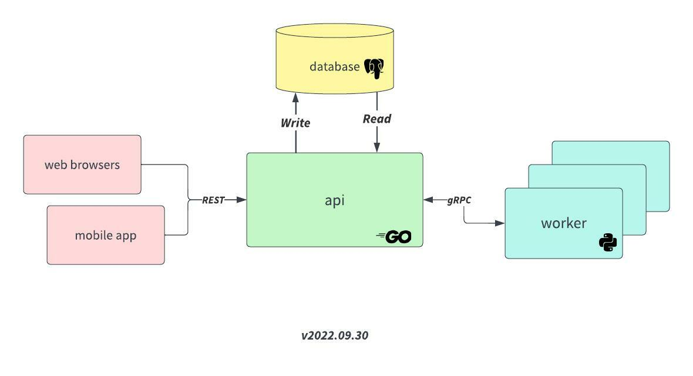

# Design Document

## Requirements
- [EPICs](https://github.com/users/prabhuomkar/projects/5/views/7)


## Architecture


## High Level Design

### Components

#### API
- [Swagger Open API Spec](assets/swagger.yaml)
- Service written in Golang
    - REST API: [echo](https://echo.labstack.com/)
    - RPC: [gRPC + protobuf](https://grpc.io/)
    - Logging: [zap](https://github.com/uber-go/zap)
    - Postgres: [dbq](https://github.com/rocketlaunchr/dbq)
    - Linting: [golangci-lint](https://golangci-lint.run/)
- Will read/write to Database
- Will exchange protobuf with Worker

#### Database
- [Postgres DB Schema](assets/schema.sql)
- Total number of tables: 12
- **Entities**:
    - MediaItem: `mediaitems`, `mediaitem_metadata`
    - Album: `albums`, `album_mediaitems`
    - Explore: `places`, `things`, `people`, `place_mediaitems`, `things_mediaitems`, `people_mediaitems`

#### Worker
- Service written in Python
    - RPC: [gRPC + protobuf](https://grpc.io/)
    - Linting: [pylint](https://pypi.org/project/pylint/)
    - Exiftool: [PyExifTool](https://pypi.org/project/PyExifTool/)
    - LibRaw: [rawpy](https://pypi.org/project/rawpy/)
- Will process images and videos
- Will exchange protobuf with API

### Image & Video Processing

#### Parsing Metadata 
- [ExifTool](https://www.exiftool.org/) - Getting EXIF and XMP data

#### Extracting Thumbnail
- [LibRaw](https://www.libraw.org/) - Processing and extracting RAW images

#### Supported File Formats
| Type | Extension | Support |
| ---- | --------- | ------- |
| Photo | .BMP | ❓ |
| Photo | .GIF | ❓ |
| Photo | .HEIC | ❓ |
| Photo | .ICO | ❓ |
| Photo | .JPG | ❓ |
| Photo | .PNG | ❓ |
| Photo | .TIFF | ❓ |
| Photo | .WEBP | ❓ |
| Photo | [RAW Formats](https://www.libraw.org/supported-cameras) | ❓ |
| Video | 3GP | ❓ |
| Video | 3G2 | ❓ |
| Video | ASF | ❓ |
| Video | AVI | ❓ |
| Video | DIVX | ❓ |
| Video | M2T | ❓ |
| Video | M2TS | ❓ |
| Video | M4V | ❓ |
| Video | MKV | ❓ |
| Video | MMV | ❓ |
| Video | MOD | ❓ |
| Video | MOV | ❓ |
| Video | MP4 | ❓ |
| Video | MPG | ❓ |
| Video | MTS | ❓ |
| Video | TOD | ❓ |
| Video | WMV | ❓ |
- TODO(omkar): Investiage support for Android Motion Photos, iOS Live Photos

### File Storage & Retrieval
- Support for several file storage systems behind a common interface:
```
interface {
    Init() // initialize client connection
    Upload() // upload the file in chunks
    Delete() // delete the file
}
```
- Out of the box incremental support for MinIO, Amazon S3, Google Storage

### Machine Learning Inference
TODO(omkar): Add more information

## Performance
- Benchmarking with several parallel uploads and system configuration
- Results of benchmarks and some graphs

## Testing
- E2E Automation Testing using `behave`

## Security
- Authentication mechanisms; Basic Auth & JWT
- Accessing CDN files using hash keys

## Deployment
- Docker Deployment 
- Volumes and Other Concerns
- Working with HTTPS
